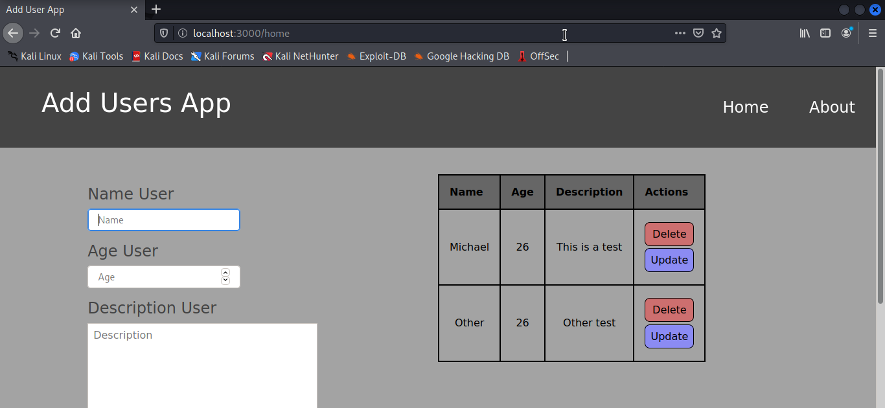

# Add Users App.

__This is a web application for add, select, delete, and updated users in a database of sqlite3. Maked with python and flask.__

## Dependencies.
__You can install the dependencies with the requiremets file, but this proyect only denpend of flask module. Execute:__
```bash
$ pip3 install -r requirements.txt
```

__Or:__

```bash
$ pip3 install flask
```

## Screnshot.
